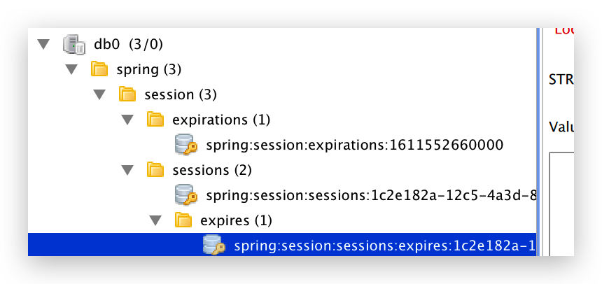

# Redis存储Session

将容器存储 Session 策略调整为 Redis 存储。

## 依赖

依赖 cas-server-support-session-redis 模块

```xml
<dependency>
  <groupId>org.apereo.cas</groupId>
  <artifactId>cas-server-support-session-redis</artifactId>
  <version>${cas.version}</version>
</dependency>
```

## 配置

```properties
##
# Spring Redis Session
spring.session.store-type=redis
spring.redis.host=127.0.0.1
spring.redis.port=6379
spring.redis.database=0
spring.redis.password=
spring.redis.timeout=3000
spring.redis.lettuce.pool.max-active=16
spring.redis.lettuce.pool.max-idle=8
spring.redis.lettuce.pool.min-idle=4
spring.redis.lettuce.pool.max-wait=3000

##
# CAS Webflow
cas.webflow.always-pause-redirect=false
cas.webflow.refresh=true
cas.webflow.redirect-same-state=false
cas.webflow.autoconfigure=true

cas.webflow.session.lockTimeout=PT30S
cas.webflow.session.compress=false
cas.webflow.session.maxConversations=5
cas.webflow.session.storage=true
```

重启即可。默认前缀为 `spring:session:`


