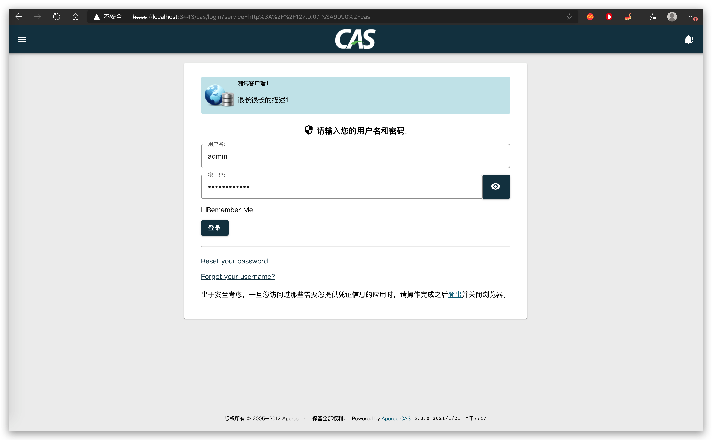
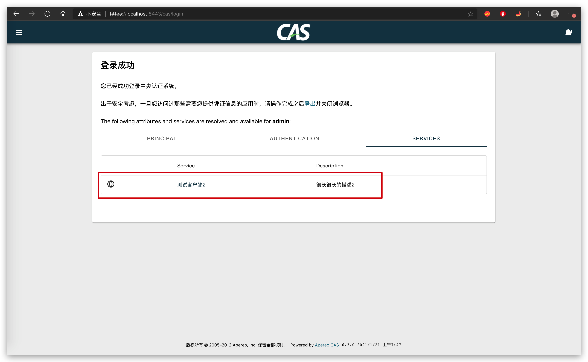
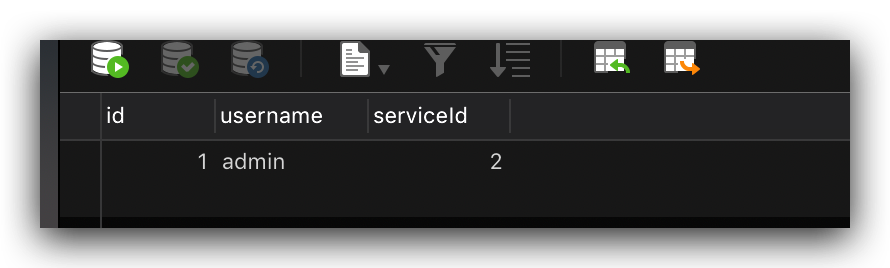

# SpringBoot客户端接入

## 客户端

以 spring boot 接入为例。

### 依赖

```xml
<dependency>
  <groupId>org.jasig.cas.client</groupId>
  <artifactId>cas-client-support-springboot</artifactId>
  <version>${cas-client.version}</version>
</dependency>
```

### 配置

其中，该配置：

- cas 服务端地址为 https://localhost:8443/cas
- cas 客户端访问 /cas/* 路径则会进行认证

```yaml
server:
  port: 9090

cas:
  # cas服务端地址
  server-url-prefix: https://localhost:8443/cas
  # cas服务端登录地址
  server-login-url: ${cas.server-url-prefix}/login
  # 客户端不要用localhost
  client-host-url: http://127.0.0.1:9090
  # 认证url
  authentication-url-patterns:
    - /cas/*
  # 校验url
  request-wrapper-url-patterns:
    - /*
  # 对url进行包装，之后就可在request中获取到用户信息
  validation-url-patterns:
    - /*
  # 当前线程中哪些url可以获取到用户信息
  assertion-thread-local-url-patterns:
    - /*
  # 单点退出
  singleLogout:
    enabled: true
  # cas服务端登出地址
  server-logout-url: ${cas.server-url-prefix}/logout

logging:
  level:
    tk.fishfish.cas: INFO
    org.jasig.cas.client: DEBUG

```

### 单点登录登出

当访问客户端 /cas/login 路径则跳转到 cas server 去单点登录

当访问客户端 /cas/logout 路径则跳转到 cas server 去单点登出

```java
package tk.fishfish.cas.client.controller;

import org.springframework.beans.factory.annotation.Value;
import org.springframework.stereotype.Controller;
import org.springframework.web.bind.annotation.GetMapping;
import org.springframework.web.bind.annotation.RequestMapping;
import org.springframework.web.servlet.view.RedirectView;

import javax.servlet.http.HttpSession;

/**
 * CAS控制器
 *
 * @author 奔波儿灞
 * @version 1.0.0
 */
@Controller
@RequestMapping("/cas")
public class CasController {

    @Value("${cas.server-login-url}")
    private String serverLoginUrl;

    @Value("${cas.server-logout-url}")
    private String serverLogoutUrl;

    /**
     * 单点登录
     *
     * @return 重定向到CAS服务
     */
    @GetMapping("/login")
    public RedirectView login() {
        return new RedirectView(serverLoginUrl);
    }

    /**
     * 单点退出
     *
     * @param session HttpSession
     * @return 重定向到CAS服务
     */
    @GetMapping("/logout")
    public RedirectView logout(HttpSession session) {
        session.invalidate();
        return new RedirectView(serverLogoutUrl);
    }

}
```

### 用户未授权服务

如果账号未授权该服务，则从 cas server 进行 ST 校验会失败，并抛出异常。此时，会再次跳转到 cas server 的登录成功界面，展示该账号授权的服务。

下面是 cas filter 异常捕获，并跳转到 cas server 登录界面的主体逻辑。

```java
package tk.fishfish.cas.client.config;

import lombok.RequiredArgsConstructor;
import lombok.extern.slf4j.Slf4j;
import org.jasig.cas.client.validation.TicketValidationException;
import org.springframework.web.filter.OncePerRequestFilter;

import javax.servlet.FilterChain;
import javax.servlet.ServletException;
import javax.servlet.http.HttpServletRequest;
import javax.servlet.http.HttpServletResponse;
import java.io.IOException;

/**
 * 异常过滤器
 *
 * @author 奔波儿灞
 * @version 1.0.0
 */
@Slf4j
@RequiredArgsConstructor
public class CasExceptionHandlerFilter extends OncePerRequestFilter {

    private final String serverLoginUrl;

    @Override
    @SuppressWarnings("NullableProblems")
    protected void doFilterInternal(HttpServletRequest request, HttpServletResponse response, FilterChain chain)
            throws ServletException, IOException {
        try {
            chain.doFilter(request, response);
        } catch (ServletException e) {
            if (e.getCause() instanceof TicketValidationException) {
                log.warn("tickets验证失败: " + e.getMessage(), e);
                // tickets验证失败 跳转到 cas server
                response.sendRedirect(serverLoginUrl);
                return;
            }
            throw e;
        }
    }
}
```

比如，账号 admin 登录成功，但是未授权 http://127.0.0.1:9090 服务，跳转到登录成功界面，告知用户只授权了  http://127.0.0.1:10000 服务。





### 单点登出回调

对于单点登出后，如果有自定义业务逻辑，比如需要拿到账号做一些额外的操作，此时可以利用提供的 tk.fishfish.cas.client.config.SingleLogoutHandler 接口回调。

```java
package tk.fishfish.cas.client.config;

/**
 * 单点登出处理
 *
 * @author 奔波儿灞
 * @version 1.0.0
 */
@FunctionalInterface
public interface SingleLogoutHandler {

    /**
     * 账号单点登出
     *
     * @param username 账号
     */
    void logout(String username);

}
```

## 服务端

设计账号授权服务关联表。



### 认证查询授权服务

自定义认证，在常规认证之后，查询授权的服务。

```java
package tk.fishfish.cas.server.authentication;

import com.google.common.collect.Maps;
import lombok.extern.slf4j.Slf4j;
import lombok.val;
import org.apache.commons.lang3.BooleanUtils;
import org.apache.commons.lang3.StringUtils;
import org.apache.commons.lang3.math.NumberUtils;
import org.apereo.cas.adaptors.jdbc.AbstractJdbcUsernamePasswordAuthenticationHandler;
import org.apereo.cas.authentication.AuthenticationHandlerExecutionResult;
import org.apereo.cas.authentication.PreventedException;
import org.apereo.cas.authentication.credential.UsernamePasswordCredential;
import org.apereo.cas.authentication.exceptions.AccountDisabledException;
import org.apereo.cas.authentication.exceptions.AccountPasswordMustChangeException;
import org.apereo.cas.authentication.principal.PrincipalFactory;
import org.apereo.cas.services.ServicesManager;
import org.apereo.cas.util.CollectionUtils;
import org.springframework.dao.DataAccessException;
import org.springframework.dao.IncorrectResultSizeDataAccessException;

import javax.security.auth.login.AccountNotFoundException;
import javax.security.auth.login.FailedLoginException;
import javax.sql.DataSource;
import java.security.GeneralSecurityException;
import java.util.ArrayList;
import java.util.Collection;
import java.util.LinkedHashMap;
import java.util.List;
import java.util.Map;

/**
 * 认证，查询授权服务
 *
 * @author 奔波儿灞
 * @version 1.0.0
 */
@Slf4j
public class AccountAuthenticationHandler extends AbstractJdbcUsernamePasswordAuthenticationHandler {

    private final String sql;
    private final String fieldPassword;
    private final String fieldExpired;
    private final String fieldDisabled;
    private final Map<String, Object> principalAttributeMap;

    public AccountAuthenticationHandler(final String name,
                                        final ServicesManager servicesManager,
                                        final PrincipalFactory principalFactory,
                                        final Integer order,
                                        final DataSource dataSource,
                                        final String sql,
                                        final String fieldPassword,
                                        final String fieldExpired,
                                        final String fieldDisabled,
                                        final Map<String, Object> attributes) {
        super(name, servicesManager, principalFactory, order, dataSource);
        this.sql = sql;
        this.fieldPassword = fieldPassword;
        this.fieldExpired = fieldExpired;
        this.fieldDisabled = fieldDisabled;
        this.principalAttributeMap = attributes;

        if (StringUtils.isBlank(this.fieldPassword)) {
            log.warn("When the password field is left undefined, CAS will skip comparing database and user passwords for equality," +
                    " (specially if the query results do not contain the password field), and will instead only rely on a successful " +
                    "query execution with returned results in order to verify credentials");
        }
    }

    @Override
    protected AuthenticationHandlerExecutionResult authenticateUsernamePasswordInternal(final UsernamePasswordCredential credential,
                                                                                        final String originalPassword)
            throws GeneralSecurityException, PreventedException {
        val attributes = Maps.<String, List<Object>>newHashMapWithExpectedSize(this.principalAttributeMap.size());
        val username = credential.getUsername();
        val password = credential.getPassword();
        try {
            val dbFields = query(credential);
            if (dbFields.containsKey(this.fieldPassword)) {
                val dbPassword = (String) dbFields.get(this.fieldPassword);

                val originalPasswordMatchFails = StringUtils.isNotBlank(originalPassword) && !matches(originalPassword, dbPassword);
                val originalPasswordEquals = StringUtils.isBlank(originalPassword) && !StringUtils.equals(password, dbPassword);
                if (originalPasswordMatchFails || originalPasswordEquals) {
                    throw new FailedLoginException("Password does not match value on record.");
                }
            } else {
                log.debug("Password field is not found in the query results. Checking for result count...");
                if (!dbFields.containsKey("total")) {
                    throw new FailedLoginException("Missing field 'total' from the query results for " + username);
                }

                val count = dbFields.get("total");
                if (count == null || !NumberUtils.isCreatable(count.toString())) {
                    throw new FailedLoginException("Missing field value 'total' from the query results for " + username + " or value not parseable as a number");
                }

                val number = NumberUtils.createNumber(count.toString());
                if (number.longValue() != 1) {
                    throw new FailedLoginException("No records found for user " + username);
                }
            }

            if (StringUtils.isNotBlank(this.fieldDisabled) && dbFields.containsKey(this.fieldDisabled)) {
                val dbDisabled = dbFields.get(this.fieldDisabled).toString();
                if (BooleanUtils.toBoolean(dbDisabled) || "1".equals(dbDisabled)) {
                    throw new AccountDisabledException("Account has been disabled");
                }
            }
            if (StringUtils.isNotBlank(this.fieldExpired) && dbFields.containsKey(this.fieldExpired)) {
                val dbExpired = dbFields.get(this.fieldExpired).toString();
                if (BooleanUtils.toBoolean(dbExpired) || "1".equals(dbExpired)) {
                    throw new AccountPasswordMustChangeException("Password has expired");
                }
            }
            collectPrincipalAttributes(attributes, dbFields);
            collectServicesPrincipalAttributes(attributes, username);
        } catch (final IncorrectResultSizeDataAccessException e) {
            if (e.getActualSize() == 0) {
                throw new AccountNotFoundException(username + " not found with SQL query");
            }
            throw new FailedLoginException("Multiple records found for " + username);
        } catch (final DataAccessException e) {
            throw new PreventedException(e);
        }
        val principal = this.principalFactory.createPrincipal(username, attributes);
        return createHandlerResult(credential, principal, new ArrayList<>(0));
    }

    private Map<String, Object> query(final UsernamePasswordCredential credential) {
        if (this.sql.contains("?")) {
            return getJdbcTemplate().queryForMap(this.sql, credential.getUsername());
        }
        val parameters = new LinkedHashMap<String, Object>();
        parameters.put("username", credential.getUsername());
        parameters.put("password", credential.getPassword());
        return getNamedParameterJdbcTemplate().queryForMap(this.sql, parameters);
    }

    @SuppressWarnings("unchecked")
    private void collectPrincipalAttributes(final Map<String, List<Object>> attributes, final Map<String, Object> dbFields) {
        this.principalAttributeMap.forEach((key, names) -> {
            val attribute = dbFields.get(key);
            if (attribute != null) {
                log.debug("Found attribute [{}] from the query results", key);
                val attributeNames = (Collection<String>) names;
                attributeNames.forEach(s -> {
                    log.debug("Principal attribute [{}] is virtually remapped/renamed to [{}]", key, s);
                    attributes.put(s, CollectionUtils.wrap(attribute.toString()));
                });
            } else {
                log.warn("Requested attribute [{}] could not be found in the query results", key);
            }
        });
    }

    private void collectServicesPrincipalAttributes(final Map<String, List<Object>> attributes, final String username) {
        // 查询授权服务
        List<Object> serviceIds = getJdbcTemplate().queryForList(
                "SELECT s.service_Id FROM account_grant_service ags LEFT JOIN regex_registered_service s ON ags.serviceId = s.id where ags.username = ?",
                new Object[]{username},
                Object.class
        );
        attributes.put("serviceIds", serviceIds);
    }

}
```

注册自定义配置

```java
package tk.fishfish.cas.server.authentication;

import lombok.extern.slf4j.Slf4j;
import lombok.val;
import org.apache.commons.lang3.StringUtils;
import org.apereo.cas.adaptors.jdbc.AbstractJdbcUsernamePasswordAuthenticationHandler;
import org.apereo.cas.adaptors.jdbc.BindModeSearchDatabaseAuthenticationHandler;
import org.apereo.cas.adaptors.jdbc.QueryAndEncodeDatabaseAuthenticationHandler;
import org.apereo.cas.adaptors.jdbc.SearchModeSearchDatabaseAuthenticationHandler;
import org.apereo.cas.adaptors.jdbc.config.CasJdbcAuthenticationConfiguration;
import org.apereo.cas.authentication.AuthenticationEventExecutionPlanConfigurer;
import org.apereo.cas.authentication.AuthenticationHandler;
import org.apereo.cas.authentication.CoreAuthenticationUtils;
import org.apereo.cas.authentication.principal.PrincipalFactory;
import org.apereo.cas.authentication.principal.PrincipalFactoryUtils;
import org.apereo.cas.authentication.principal.PrincipalNameTransformerUtils;
import org.apereo.cas.authentication.principal.PrincipalResolver;
import org.apereo.cas.authentication.support.password.PasswordEncoderUtils;
import org.apereo.cas.authentication.support.password.PasswordPolicyContext;
import org.apereo.cas.configuration.CasConfigurationProperties;
import org.apereo.cas.configuration.model.support.jdbc.authn.BaseJdbcAuthenticationProperties;
import org.apereo.cas.configuration.model.support.jdbc.authn.BindJdbcAuthenticationProperties;
import org.apereo.cas.configuration.model.support.jdbc.authn.QueryEncodeJdbcAuthenticationProperties;
import org.apereo.cas.configuration.model.support.jdbc.authn.QueryJdbcAuthenticationProperties;
import org.apereo.cas.configuration.model.support.jdbc.authn.SearchJdbcAuthenticationProperties;
import org.apereo.cas.configuration.support.JpaBeans;
import org.apereo.cas.services.ServicesManager;
import org.apereo.cas.util.CollectionUtils;
import org.springframework.beans.factory.ObjectProvider;
import org.springframework.beans.factory.annotation.Autowired;
import org.springframework.beans.factory.annotation.Qualifier;
import org.springframework.boot.autoconfigure.AutoConfigureBefore;
import org.springframework.boot.autoconfigure.condition.ConditionalOnMissingBean;
import org.springframework.boot.context.properties.EnableConfigurationProperties;
import org.springframework.cloud.context.config.annotation.RefreshScope;
import org.springframework.context.ConfigurableApplicationContext;
import org.springframework.context.annotation.Bean;
import org.springframework.context.annotation.Configuration;

import java.util.Collection;
import java.util.HashSet;

/**
 * 自定义认证
 *
 * @author 奔波儿灞
 * @version 1.0.0
 */
@Slf4j
@Configuration("accountAuthenticationConfiguration")
@AutoConfigureBefore(CasJdbcAuthenticationConfiguration.class)
@EnableConfigurationProperties(CasConfigurationProperties.class)
public class AccountAuthenticationConfiguration {

    @Autowired
    @Qualifier("servicesManager")
    private ObjectProvider<ServicesManager> servicesManager;

    @Autowired
    private ConfigurableApplicationContext applicationContext;

    @Autowired
    private CasConfigurationProperties casProperties;

    @Autowired
    @Qualifier("defaultPrincipalResolver")
    private ObjectProvider<PrincipalResolver> defaultPrincipalResolver;

    @Bean
    @RefreshScope
    @ConditionalOnMissingBean(name = "jdbcAuthenticationHandlers")
    public Collection<AuthenticationHandler> jdbcAuthenticationHandlers() {
        val handlers = new HashSet<AuthenticationHandler>();
        val jdbc = casProperties.getAuthn().getJdbc();
        jdbc.getBind().forEach(b -> handlers.add(bindModeSearchDatabaseAuthenticationHandler(b)));
        jdbc.getEncode().forEach(b -> handlers.add(queryAndEncodeDatabaseAuthenticationHandler(b)));
        jdbc.getQuery().forEach(b -> handlers.add(queryDatabaseAuthenticationHandler(b)));
        jdbc.getSearch().forEach(b -> handlers.add(searchModeSearchDatabaseAuthenticationHandler(b)));
        return handlers;
    }

    @Bean
    @RefreshScope
    @ConditionalOnMissingBean(name = "jdbcPrincipalFactory")
    public PrincipalFactory jdbcPrincipalFactory() {
        return PrincipalFactoryUtils.newPrincipalFactory();
    }

    @Bean
    @RefreshScope
    @ConditionalOnMissingBean(name = "queryAndEncodePasswordPolicyConfiguration")
    public PasswordPolicyContext queryAndEncodePasswordPolicyConfiguration() {
        return new PasswordPolicyContext();
    }

    @Bean
    @RefreshScope
    @ConditionalOnMissingBean(name = "searchModePasswordPolicyConfiguration")
    public PasswordPolicyContext searchModePasswordPolicyConfiguration() {
        return new PasswordPolicyContext();
    }

    @Bean
    @RefreshScope
    @ConditionalOnMissingBean(name = "queryPasswordPolicyConfiguration")
    public PasswordPolicyContext queryPasswordPolicyConfiguration() {
        return new PasswordPolicyContext();
    }

    @Bean
    @RefreshScope
    @ConditionalOnMissingBean(name = "bindSearchPasswordPolicyConfiguration")
    public PasswordPolicyContext bindSearchPasswordPolicyConfiguration() {
        return new PasswordPolicyContext();
    }

    @Bean
    @RefreshScope
    @ConditionalOnMissingBean(name = "jdbcAuthenticationEventExecutionPlanConfigurer")
    public AuthenticationEventExecutionPlanConfigurer jdbcAuthenticationEventExecutionPlanConfigurer() {
        return plan -> jdbcAuthenticationHandlers()
                .forEach(h -> plan.registerAuthenticationHandlerWithPrincipalResolver(h, defaultPrincipalResolver.getObject()));
    }

    private AuthenticationHandler bindModeSearchDatabaseAuthenticationHandler(final BindJdbcAuthenticationProperties b) {
        val h = new BindModeSearchDatabaseAuthenticationHandler(b.getName(), servicesManager.getObject(),
                jdbcPrincipalFactory(), b.getOrder(), JpaBeans.newDataSource(b));
        configureJdbcAuthenticationHandler(h, b);
        return h;
    }

    private AuthenticationHandler queryAndEncodeDatabaseAuthenticationHandler(final QueryEncodeJdbcAuthenticationProperties b) {
        val h = new QueryAndEncodeDatabaseAuthenticationHandler(b.getName(), servicesManager.getObject(),
                jdbcPrincipalFactory(), b.getOrder(), JpaBeans.newDataSource(b), b.getAlgorithmName(), b.getSql(), b.getPasswordFieldName(),
                b.getSaltFieldName(), b.getExpiredFieldName(), b.getDisabledFieldName(), b.getNumberOfIterationsFieldName(), b.getNumberOfIterations(),
                b.getStaticSalt());

        configureJdbcAuthenticationHandler(h, b);
        return h;
    }

    private AuthenticationHandler queryDatabaseAuthenticationHandler(final QueryJdbcAuthenticationProperties b) {
        val attributes = CoreAuthenticationUtils.transformPrincipalAttributesListIntoMultiMap(b.getPrincipalAttributeList());
        log.trace("Created and mapped principal attributes [{}] for [{}]...", attributes, b.getUrl());

        // 替换实现
        val h = new AccountAuthenticationHandler(b.getName(), servicesManager.getObject(),
                jdbcPrincipalFactory(), b.getOrder(), JpaBeans.newDataSource(b), b.getSql(), b.getFieldPassword(),
                b.getFieldExpired(), b.getFieldDisabled(), CollectionUtils.wrap(attributes));

        configureJdbcAuthenticationHandler(h, b);
        h.setPasswordPolicyConfiguration(queryPasswordPolicyConfiguration());
        return h;
    }

    private AuthenticationHandler searchModeSearchDatabaseAuthenticationHandler(final SearchJdbcAuthenticationProperties b) {
        val h = new SearchModeSearchDatabaseAuthenticationHandler(b.getName(), servicesManager.getObject(),
                jdbcPrincipalFactory(), b.getOrder(), JpaBeans.newDataSource(b),
                b.getFieldUser(), b.getFieldPassword(), b.getTableUsers());
        configureJdbcAuthenticationHandler(h, b);
        return h;
    }

    private void configureJdbcAuthenticationHandler(final AbstractJdbcUsernamePasswordAuthenticationHandler handler,
                                                    final BaseJdbcAuthenticationProperties properties) {
        handler.setPasswordEncoder(PasswordEncoderUtils.newPasswordEncoder(properties.getPasswordEncoder(), applicationContext));
        handler.setPrincipalNameTransformer(PrincipalNameTransformerUtils.newPrincipalNameTransformer(properties.getPrincipalTransformation()));
        handler.setPasswordPolicyConfiguration(bindSearchPasswordPolicyConfiguration());

        if (StringUtils.isNotBlank(properties.getCredentialCriteria())) {
            handler.setCredentialSelectionPredicate(CoreAuthenticationUtils.newCredentialSelectionPredicate(properties.getCredentialCriteria()));
        }
        log.trace("Configured authentication handler [{}] to handle database url at [{}]", handler.getName(), properties.getUrl());
    }

}
```

### 客户端服务验证

当 cas 客户端跳转到 cas 服务端登录后得到 ST ，并进行服务校验。此时，服务端判断检测账号是否授权该服务。如果授权则能正常通过 ST 检测，否则告知客户端失败。客户端得到错误后，上文跳转到了服务端的登录页面。

实现 ServiceTicketValidationAuthorizer 接口，自定义账号授权服务校验。

```java
package tk.fishfish.cas.server.validation;

import lombok.RequiredArgsConstructor;
import lombok.extern.slf4j.Slf4j;
import org.apache.commons.lang3.ArrayUtils;
import org.apereo.cas.authentication.principal.Service;
import org.apereo.cas.services.RegisteredService;
import org.apereo.cas.services.ServicesManager;
import org.apereo.cas.services.UnauthorizedServiceException;
import org.apereo.cas.validation.Assertion;
import org.apereo.cas.validation.ServiceTicketValidationAuthorizer;

import javax.servlet.http.HttpServletRequest;
import java.util.List;

/**
 * 验证账号是否授权服务
 *
 * @author 奔波儿灞
 * @version 1.0.0
 */
@Slf4j
@RequiredArgsConstructor
public class AccountServiceTicketValidationAuthorizer implements ServiceTicketValidationAuthorizer {

    private final ServicesManager servicesManager;

    @Override
    public void authorize(HttpServletRequest request, Service service, Assertion assertion) {
        RegisteredService registeredService = servicesManager.findServiceBy(service);
        if (registeredService == null) {
            log.warn("Service is not found in service registry");
            throw new UnauthorizedServiceException(UnauthorizedServiceException.CODE_UNAUTHZ_SERVICE, "Service is not found in service registry.");
        }
        String username = assertion.getPrimaryAuthentication().getPrincipal().getId();
        List<Object> serviceIds = assertion.getPrimaryAuthentication().getPrincipal().getAttributes().get("serviceIds");
        log.debug("检测账号 {}-[{}] 是否授权服务: {}", username, ArrayUtils.toString(serviceIds), service.getId());
        for (Object serviceId : serviceIds) {
            if ("*".equals(serviceId.toString())) {
                return;
            }
            if (registeredService.matches(serviceId.toString())) {
                return;
            }
        }
        log.warn("Service [{}] is not grant to account: {}", service.getId(), username);
        throw new UnauthorizedServiceException(UnauthorizedServiceException.CODE_UNAUTHZ_SERVICE, "Service [" + service.getId() + "] is not grant to account: " + username);
    }

}
```

注意前面创建 Service 时，允许所有的属性返回。

注册自定义配置

```java
package tk.fishfish.cas.server.validation;

import org.apereo.cas.configuration.CasConfigurationProperties;
import org.apereo.cas.services.ServicesManager;
import org.apereo.cas.validation.ServiceTicketValidationAuthorizerConfigurer;
import org.apereo.cas.validation.ServiceTicketValidationAuthorizersExecutionPlan;
import org.springframework.beans.factory.ObjectProvider;
import org.springframework.beans.factory.annotation.Autowired;
import org.springframework.beans.factory.annotation.Qualifier;
import org.springframework.boot.context.properties.EnableConfigurationProperties;
import org.springframework.context.annotation.Configuration;

/**
 * 注册自定义账号服务Ticket认证
 *
 * @author 奔波儿灞
 * @version 1.0.0
 */
@Configuration("accountServiceTicketValidationAuthorizerConfigurer")
@EnableConfigurationProperties(CasConfigurationProperties.class)
public class AccountServiceTicketValidationAuthorizerConfigurer implements ServiceTicketValidationAuthorizerConfigurer {

    @Autowired
    @Qualifier("servicesManager")
    private ObjectProvider<ServicesManager> servicesManager;

    @Override
    public void configureAuthorizersExecutionPlan(ServiceTicketValidationAuthorizersExecutionPlan plan) {
        plan.registerAuthorizer(new AccountServiceTicketValidationAuthorizer(servicesManager.getObject()));
    }

}
```

### 服务匹配策略

修改匹配策略，只需要当前 url 前缀匹配注册的服务 url 即可。

```java
package tk.fishfish.cas.server.services;

import lombok.extern.slf4j.Slf4j;
import lombok.val;
import org.apache.commons.lang3.StringUtils;
import org.apereo.cas.authentication.principal.Service;
import org.apereo.cas.authentication.principal.ServiceMatchingStrategy;
import org.apereo.cas.util.LoggingUtils;

import java.net.URLDecoder;
import java.nio.charset.StandardCharsets;

/**
 * 前缀匹配
 *
 * @author 奔波儿灞
 * @version 1.0.0
 */
@Slf4j
public class StartWithServiceMatchingStrategy implements ServiceMatchingStrategy {

    @Override
    public boolean matches(Service service, Service serviceToMatch) {
        try {
            val thisUrl = URLDecoder.decode(service.getId(), StandardCharsets.UTF_8.name());
            val serviceUrl = URLDecoder.decode(serviceToMatch.getId(), StandardCharsets.UTF_8.name());
            log.debug("Decoded urls and comparing [{}] with [{}]", thisUrl, serviceUrl);
            return StringUtils.startsWithIgnoreCase(thisUrl, serviceUrl);
        } catch (final Exception e) {
            LoggingUtils.error(log, e);
        }
        return false;
    }

}
```

注册配置：

```java
package tk.fishfish.cas.server.services;

import org.apereo.cas.authentication.principal.ServiceMatchingStrategy;
import org.apereo.cas.config.CasCoreConfiguration;
import org.apereo.cas.configuration.CasConfigurationProperties;
import org.springframework.boot.autoconfigure.AutoConfigureBefore;
import org.springframework.boot.autoconfigure.condition.ConditionalOnMissingBean;
import org.springframework.boot.context.properties.EnableConfigurationProperties;
import org.springframework.context.annotation.Bean;
import org.springframework.context.annotation.Configuration;

/**
 * 服务配置
 *
 * @author 奔波儿灞
 * @version 1.0.0
 */
@Configuration("casServicesConfiguration")
@AutoConfigureBefore(CasCoreConfiguration.class)
@EnableConfigurationProperties(CasConfigurationProperties.class)
public class CasServicesConfiguration {

    @Bean
    @ConditionalOnMissingBean(name = "serviceMatchingStrategy")
    public ServiceMatchingStrategy serviceMatchingStrategy() {
        return new StartWithServiceMatchingStrategy();
    }

}
```
