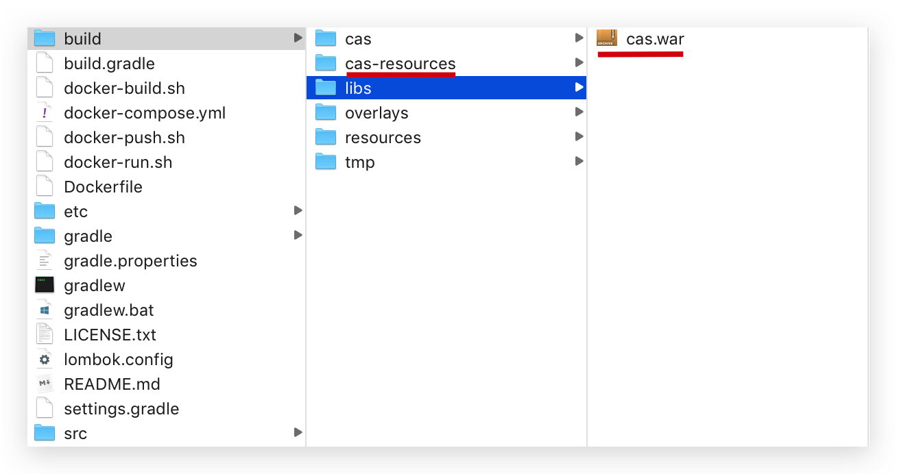
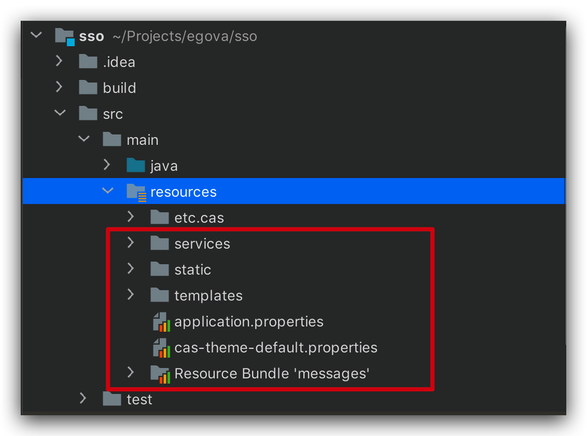
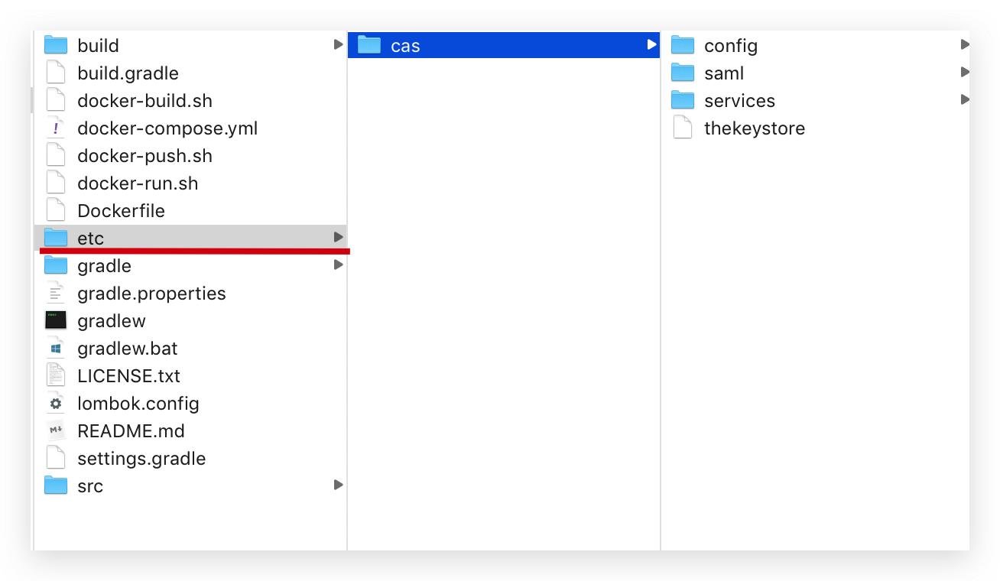
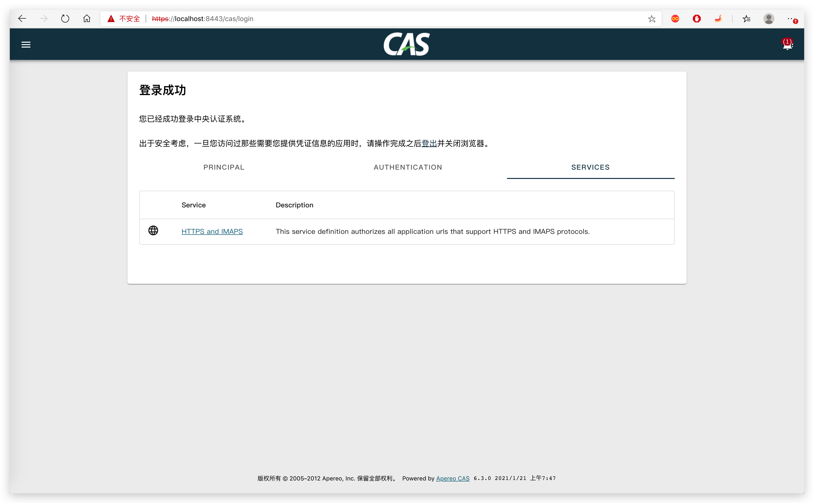

# 安装CAS

## 准备

- JDK11

## 编译Overlays

### 下载源码

下载 [cas-overlay-template](https://github.com/apereo/cas-overlay-template) 源码

切换分支

```shell
git checkout 6.3
```

### 编译

用 gradlew 编译项目，得到资源 cas.war 以及 cas-resource 下面的配置和静态资源

```shell
./gradlew getResource
```



## Spring Boot集成

### 工程搭建

- 创建工程
- 依赖 cas 相关依赖

```xml
<?xml version="1.0" encoding="UTF-8"?>
<project xmlns="http://maven.apache.org/POM/4.0.0"
         xmlns:xsi="http://www.w3.org/2001/XMLSchema-instance"
         xsi:schemaLocation="http://maven.apache.org/POM/4.0.0 http://maven.apache.org/xsd/maven-4.0.0.xsd">
    <modelVersion>4.0.0</modelVersion>

    <groupId>tk.fishfish</groupId>
    <artifactId>cas-server</artifactId>
    <version>1.0.0-SNAPSHOT</version>

    <repositories>
        <repository>
            <id>aliyunmaven</id>
            <name>aliyun maven</name>
            <url>http://maven.aliyun.com/nexus/content/groups/public/</url>
        </repository>
    </repositories>

    <properties>
        <egova.base.version>5.0.1</egova.base.version>
        <egova.bunches.version>2.0.1</egova.bunches.version>
        <spring-boot.version>2.3.7.RELEASE</spring-boot.version>
        <slf4j.version>1.7.30</slf4j.version>
        <cas.version>6.3.0</cas.version>
        <lombok.version>1.18.14</lombok.version>
        <java.version>11</java.version>
        <maven.compiler.source>${java.version}</maven.compiler.source>
        <maven.compiler.target>${java.version}</maven.compiler.target>
        <maven-compiler-plugin.version>3.8.0</maven-compiler-plugin.version>
        <maven-javadoc-plugin.version>3.2.0</maven-javadoc-plugin.version>
        <maven-deploy-plugin.version>3.0.0-M1</maven-deploy-plugin.version>
    </properties>

    <dependencies>
        <dependency>
            <groupId>org.apereo.cas</groupId>
            <artifactId>cas-server-webapp-init</artifactId>
            <version>${cas.version}</version>
        </dependency>
        <dependency>
            <groupId>org.apereo.cas</groupId>
            <artifactId>cas-server-webapp-init-tomcat</artifactId>
            <version>${cas.version}</version>
        </dependency>
        <dependency>
            <groupId>org.apereo.cas</groupId>
            <artifactId>cas-server-webapp-config</artifactId>
            <version>${cas.version}</version>
        </dependency>
        <dependency>
            <groupId>org.apereo.cas</groupId>
            <artifactId>cas-server-core</artifactId>
            <version>${cas.version}</version>
        </dependency>
        <dependency>
            <groupId>org.apereo.cas</groupId>
            <artifactId>cas-server-core-web</artifactId>
            <version>${cas.version}</version>
        </dependency>
        <dependency>
            <groupId>org.apereo.cas</groupId>
            <artifactId>cas-server-core-audit</artifactId>
            <version>${cas.version}</version>
        </dependency>
        <dependency>
            <groupId>org.apereo.cas</groupId>
            <artifactId>cas-server-core-authentication</artifactId>
            <version>${cas.version}</version>
        </dependency>
        <dependency>
            <groupId>org.apereo.cas</groupId>
            <artifactId>cas-server-core-authentication-mfa</artifactId>
            <version>${cas.version}</version>
        </dependency>
        <dependency>
            <groupId>org.apereo.cas</groupId>
            <artifactId>cas-server-core-webflow</artifactId>
            <version>${cas.version}</version>
        </dependency>
        <dependency>
            <groupId>org.apereo.cas</groupId>
            <artifactId>cas-server-core-cookie</artifactId>
            <version>${cas.version}</version>
        </dependency>
        <dependency>
            <groupId>org.apereo.cas</groupId>
            <artifactId>cas-server-core-logout</artifactId>
            <version>${cas.version}</version>
        </dependency>
        <dependency>
            <groupId>org.apereo.cas</groupId>
            <artifactId>cas-server-support-thymeleaf</artifactId>
            <version>${cas.version}</version>
        </dependency>
        <dependency>
            <groupId>org.apereo.cas</groupId>
            <artifactId>cas-server-support-captcha-core</artifactId>
            <version>${cas.version}</version>
        </dependency>
        <dependency>
            <groupId>org.apereo.cas</groupId>
            <artifactId>cas-server-support-pac4j-core</artifactId>
            <version>${cas.version}</version>
        </dependency>
        <dependency>
            <groupId>org.apereo.cas</groupId>
            <artifactId>cas-server-support-pm</artifactId>
            <version>${cas.version}</version>
        </dependency>
        <dependency>
            <groupId>org.apereo.cas</groupId>
            <artifactId>cas-server-support-rest</artifactId>
            <version>${cas.version}</version>
        </dependency>
        <!-- 服务 -->
        <dependency>
            <groupId>org.apereo.cas</groupId>
            <artifactId>cas-server-support-json-service-registry</artifactId>
            <version>${cas.version}</version>
        </dependency>

        <dependency>
            <groupId>org.springframework.boot</groupId>
            <artifactId>spring-boot-starter-web</artifactId>
            <version>${spring-boot.version}</version>
        </dependency>

        <dependency>
            <groupId>org.projectlombok</groupId>
            <artifactId>lombok</artifactId>
            <version>${lombok.version}</version>
            <scope>provided</scope>
        </dependency>
    </dependencies>

    <dependencyManagement>
        <dependencies>
            <dependency>
                <groupId>org.slf4j</groupId>
                <artifactId>slf4j-api</artifactId>
                <version>${slf4j.version}</version>
            </dependency>
            <dependency>
                <groupId>org.slf4j</groupId>
                <artifactId>jul-to-slf4j</artifactId>
                <version>${slf4j.version}</version>
            </dependency>
            <dependency>
                <groupId>org.slf4j</groupId>
                <artifactId>jcl-over-slf4j</artifactId>
                <version>${slf4j.version}</version>
            </dependency>
        </dependencies>
    </dependencyManagement>

    <build>
        <finalName>${project.artifactId}</finalName>
        <pluginManagement>
            <plugins>
                <!-- Compiler 插件, 设定JDK版本 -->
                <plugin>
                    <groupId>org.apache.maven.plugins</groupId>
                    <artifactId>maven-compiler-plugin</artifactId>
                    <version>${maven-compiler-plugin.version}</version>
                </plugin>

                <!-- 忽略javadoc测试的 -->
                <plugin>
                    <groupId>org.apache.maven.plugins</groupId>
                    <artifactId>maven-javadoc-plugin</artifactId>
                    <version>${maven-javadoc-plugin.version}</version>
                    <configuration>
                        <skip>true</skip>
                    </configuration>
                </plugin>

                <plugin>
                    <groupId>org.apache.maven.plugins</groupId>
                    <artifactId>maven-deploy-plugin</artifactId>
                    <version>${maven-deploy-plugin.version}</version>
                    <configuration>
                        <skip>false</skip>
                    </configuration>
                </plugin>
            </plugins>
        </pluginManagement>
    </build>

</project>
```

### 复制资源到工程

将上一步编译后的 cas-resource 目录下的资源复制到工程下的 src/main/resources 目录中。



然后将工程 cas-overlay-template 下的 etc 目录也复制到 src/main/resources 目录中。



### 修改启动配置

修改 application.properties 配置，将 server.ssl.key-store 定位到 classpath:etc/cas/thekeystore 文件。

```properties
##
# CAS Web Application Embedded Server SSL Configuration
#
server.ssl.key-store=classpath:etc/cas/thekeystore
server.ssl.key-store-password=changeit
server.ssl.key-password=changeit
server.ssl.enabled=true
```

### 创建启动类

创建 Spring Boot 启动类

```java
package tk.fishfish.cas.server;

import org.apereo.cas.CasEmbeddedContainerUtils;
import org.apereo.cas.web.CasWebApplicationContext;
import org.springframework.boot.WebApplicationType;
import org.springframework.boot.actuate.autoconfigure.metrics.KafkaMetricsAutoConfiguration;
import org.springframework.boot.autoconfigure.SpringBootApplication;
import org.springframework.boot.autoconfigure.cassandra.CassandraAutoConfiguration;
import org.springframework.boot.autoconfigure.data.mongo.MongoDataAutoConfiguration;
import org.springframework.boot.autoconfigure.data.redis.RedisAutoConfiguration;
import org.springframework.boot.autoconfigure.data.redis.RedisRepositoriesAutoConfiguration;
import org.springframework.boot.autoconfigure.groovy.template.GroovyTemplateAutoConfiguration;
import org.springframework.boot.autoconfigure.gson.GsonAutoConfiguration;
import org.springframework.boot.autoconfigure.jdbc.DataSourceAutoConfiguration;
import org.springframework.boot.autoconfigure.jdbc.DataSourceTransactionManagerAutoConfiguration;
import org.springframework.boot.autoconfigure.jersey.JerseyAutoConfiguration;
import org.springframework.boot.autoconfigure.jmx.JmxAutoConfiguration;
import org.springframework.boot.autoconfigure.kafka.KafkaAutoConfiguration;
import org.springframework.boot.autoconfigure.mongo.MongoAutoConfiguration;
import org.springframework.boot.autoconfigure.orm.jpa.HibernateJpaAutoConfiguration;
import org.springframework.boot.builder.SpringApplicationBuilder;
import org.springframework.cloud.client.discovery.EnableDiscoveryClient;
import org.springframework.context.annotation.EnableAspectJAutoProxy;
import org.springframework.scheduling.annotation.EnableAsync;
import org.springframework.scheduling.annotation.EnableScheduling;
import org.springframework.transaction.annotation.EnableTransactionManagement;

/**
 * CAS服务启动
 *
 * @author 奔波儿灞
 * @version 1.0.0
 */
@EnableAsync
@EnableScheduling
@EnableDiscoveryClient
@SpringBootApplication(
        exclude = {
                HibernateJpaAutoConfiguration.class,
                JerseyAutoConfiguration.class,
                GroovyTemplateAutoConfiguration.class,
                GsonAutoConfiguration.class,
                JmxAutoConfiguration.class,
                DataSourceAutoConfiguration.class,
                RedisAutoConfiguration.class,
                MongoAutoConfiguration.class,
                MongoDataAutoConfiguration.class,
                KafkaAutoConfiguration.class,
                KafkaMetricsAutoConfiguration.class,
                CassandraAutoConfiguration.class,
                DataSourceTransactionManagerAutoConfiguration.class,
                RedisRepositoriesAutoConfiguration.class
        }
)
@EnableAspectJAutoProxy(proxyTargetClass = true)
@EnableTransactionManagement(proxyTargetClass = true)
public class CasServerApplication {

    public static void main(final String[] args) {
        new SpringApplicationBuilder(CasServerApplication.class)
                .banner(CasEmbeddedContainerUtils.getCasBannerInstance())
                .web(WebApplicationType.SERVLET)
                .logStartupInfo(true)
                .contextClass(CasWebApplicationContext.class)
                .run(args);
    }

}
```

## 启动

在 IDE 中运行 CasApplication 启动类，浏览器打开：https://localhost:8443/cas

默认账号：casuser/Mellon，登录成功后即显示成功页面


