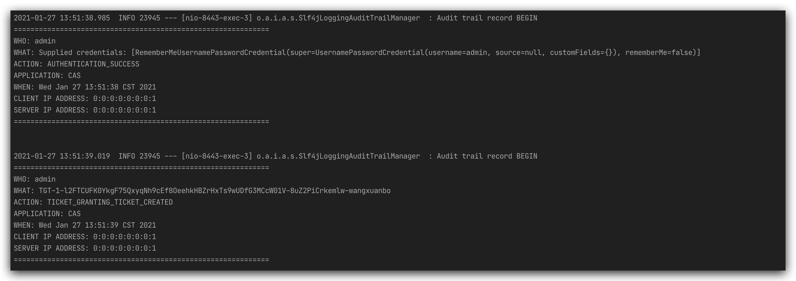
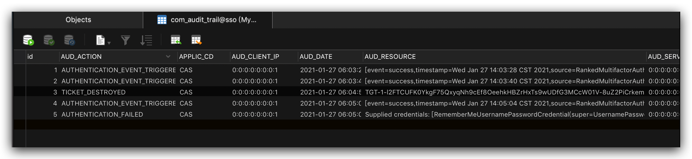
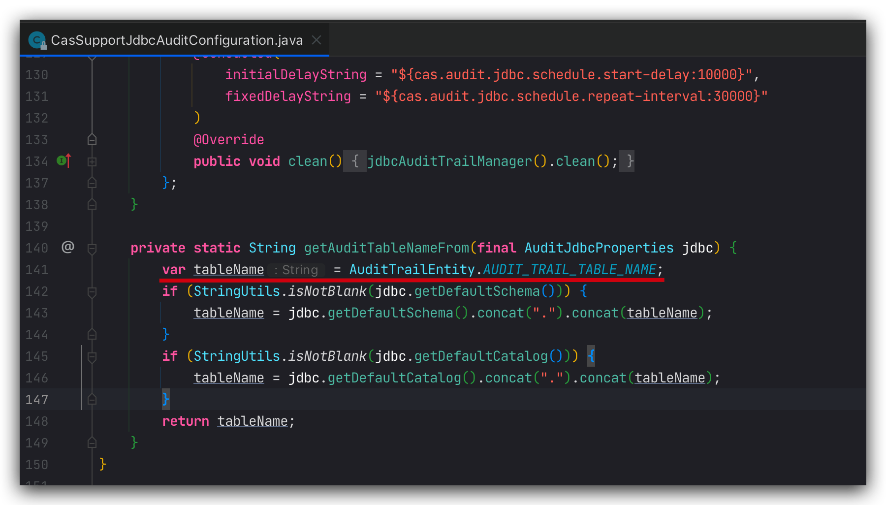

# 审计日志

默认情况下，审计日志会输出 logger 文件。



下面修改为数据库存储。

## 依赖

依赖 cas-server-support-audit-jdbc 模块

```xml
<dependency>
  <groupId>org.apereo.cas</groupId>
  <artifactId>cas-server-support-audit-jdbc</artifactId>
  <version>${cas.version}</version>
</dependency>
```

## 配置

通过 JPA 数据库存储日志，保留 30 天

```properties
##
# CAS AUDIT DATABASE
# 日志保存30天
cas.audit.jdbc.maxAgeDays=30
# jpa配置
cas.audit.jdbc.dialect=org.hibernate.dialect.MySQL8Dialect
cas.audit.jdbc.driverClass=com.mysql.cj.jdbc.Driver
cas.audit.jdbc.url=${mysql.url}
cas.audit.jdbc.user=${mysql.user}
cas.audit.jdbc.password=${mysql.password}
```

此后，审计日志除了记录 logger 文件外，会异步写入数据库表 COM_AUDIT_TRAIL 中。



其中：

- AUTHENTICATION_EVENT_TRIGGERED 触发认证
- TICKET_DESTROYED 退出登录，销毁 tickets
- AUTHENTICATION_FAILED 认证失败
- AUTHENTICATION_SUCCESS 认证成功
- TICKET_GRANTING_TICKET_CREATED 生成 tickets

要注意的是，默认写的的表名为 COM_AUDIT_TRAIL ，在不修改源码的情况下无法修改该名称。


