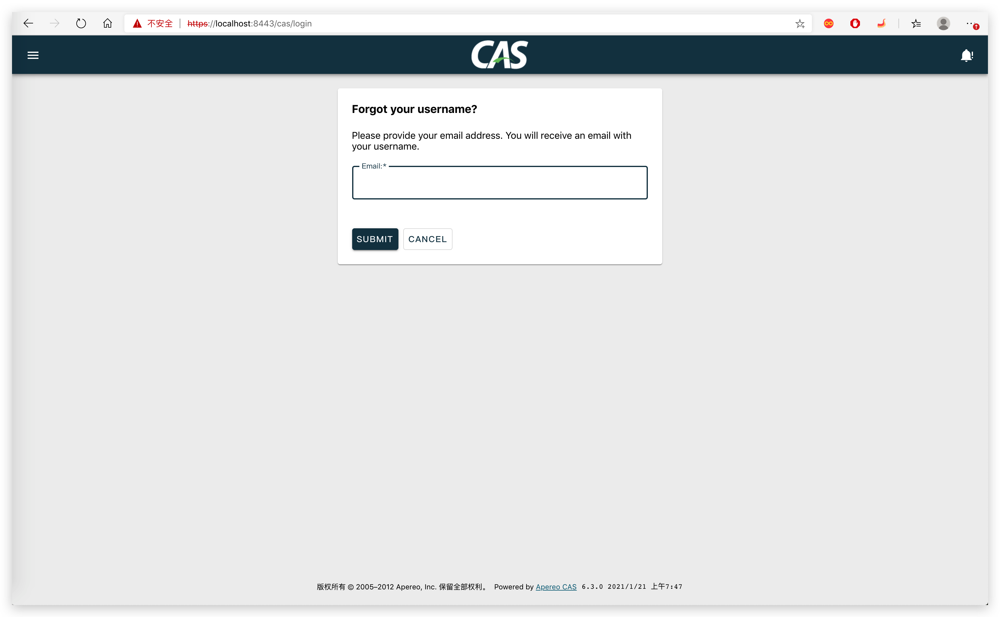

# 忘记密码

在重置密码的基础上，增加配置即可。

## 配置

```properties
##
# CAS Forgot Username
cas.authn.pm.forgotUsername.mail.from=${spring.mail.username}
cas.authn.pm.forgotUsername.mail.subject=SSO 找回账号
cas.authn.pm.forgotUsername.mail.text=打开以下链接找回您的账号（SSO）: %s
```

配置完成后，即可开启忘记账号功能。


