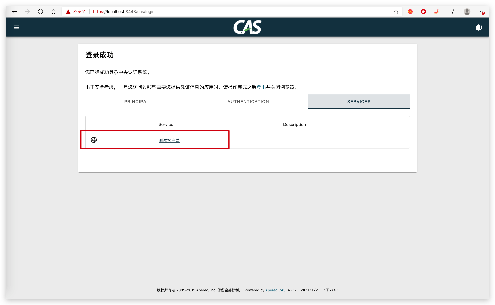

# 数据库存储服务

最开始，我们通过 json 文件配置的服务，现调整为 MySQL 存储。

## 依赖

依赖 cas-server-support-jpa-service-registry 模块

```xml
<dependency>
  <groupId>org.apereo.cas</groupId>
  <artifactId>cas-server-core-services-api</artifactId>
  <version>${cas.version}</version>
  <scope>compile</scope>
</dependency>
<dependency>
  <groupId>org.apereo.cas</groupId>
  <artifactId>cas-server-core-services-registry</artifactId>
  <version>${cas.version}</version>
  <scope>compile</scope>
</dependency>
<dependency>
  <groupId>org.apereo.cas</groupId>
  <artifactId>cas-server-support-jpa-service-registry</artifactId>
  <version>${cas.version}</version>
</dependency>
```

## 配置

```properties
##
# CAS 服务注册 - JPA
cas.service-registry.jpa.dialect=org.hibernate.dialect.MySQL8Dialect
cas.service-registry.jpa.driverClass=com.mysql.cj.jdbc.Driver
cas.service-registry.jpa.url=${mysql.url}
cas.service-registry.jpa.user=${mysql.user}
cas.service-registry.jpa.password=${mysql.password}
```

重启后，即可。




## 管理接口

提供 REST 接口，供管理员维护。

服务注册 DTO 如下：

```java
package tk.fishfish.cas.server.model;

import lombok.Data;
import org.apereo.cas.services.RegexRegisteredService;
import org.apereo.cas.services.RegisteredService;
import org.apereo.cas.services.RegisteredServiceMatchingStrategy;
import org.springframework.validation.annotation.Validated;
import tk.fishfish.cas.server.services.StartsWithRegisteredServiceMatchingStrategy;

import javax.validation.constraints.NotBlank;
import java.util.Optional;

/**
 * 服务注册DTO
 *
 * @author 奔波儿灞
 * @version 1.0.0
 */
@Data
@Validated
public class RegisteredServiceDTO {

    private Long id;

    @NotBlank
    private String name;

    @NotBlank
    private String description;

    @NotBlank
    private String serviceId;

    private RegisteredServiceMatchingStrategy matchingStrategy;

    public static RegisteredService convert(RegisteredServiceDTO dto) {
        RegexRegisteredService service = new RegexRegisteredService();
        Optional.ofNullable(dto.id).ifPresent(service::setId);
        service.setServiceId(dto.serviceId);
        service.setName(dto.name);
        service.setDescription(dto.description);
        service.setMatchingStrategy(new StartsWithRegisteredServiceMatchingStrategy());
        return service;
    }

    public static RegisteredServiceDTO convert(RegisteredService service) {
        RegisteredServiceDTO dto = new RegisteredServiceDTO();
        dto.id = service.getId();
        dto.serviceId = service.getServiceId();
        dto.name = service.getName();
        dto.description = service.getDescription();
        dto.matchingStrategy = service.getMatchingStrategy();
        return dto;
    }

}
```

API 接口如下：

```java
package tk.fishfish.cas.server.controller;

import org.apereo.cas.services.RegisteredService;
import org.apereo.cas.services.ServiceRegistry;
import org.springframework.beans.factory.annotation.Autowired;
import org.springframework.web.bind.annotation.DeleteMapping;
import org.springframework.web.bind.annotation.PathVariable;
import org.springframework.web.bind.annotation.PostMapping;
import org.springframework.web.bind.annotation.PutMapping;
import org.springframework.web.bind.annotation.RequestBody;
import org.springframework.web.bind.annotation.RequestMapping;
import org.springframework.web.bind.annotation.RestController;
import tk.fishfish.cas.server.model.RegisteredServiceDTO;

/**
 * 服务注册管理
 *
 * @author 奔波儿灞
 * @version 1.0.0
 */
@RestController
@RequestMapping("/v1/registry-service")
public class ServiceRegistryController {

    @Autowired
    private ServiceRegistry serviceRegistry;

    @PostMapping
    public RegisteredService create(@RequestBody RegisteredServiceDTO dto) {
        return serviceRegistry.save(RegisteredServiceDTO.convert(dto));
    }

    @PutMapping
    public RegisteredService modify(@RequestBody RegisteredServiceDTO dto) {
        return serviceRegistry.save(RegisteredServiceDTO.convert(dto));
    }

    @DeleteMapping("/{id}")
    public void removeById(@PathVariable long id) {
        RegisteredService service = serviceRegistry.findServiceById(id);
        if (service == null) {
            return;
        }
        serviceRegistry.delete(service);
    }

}
```
