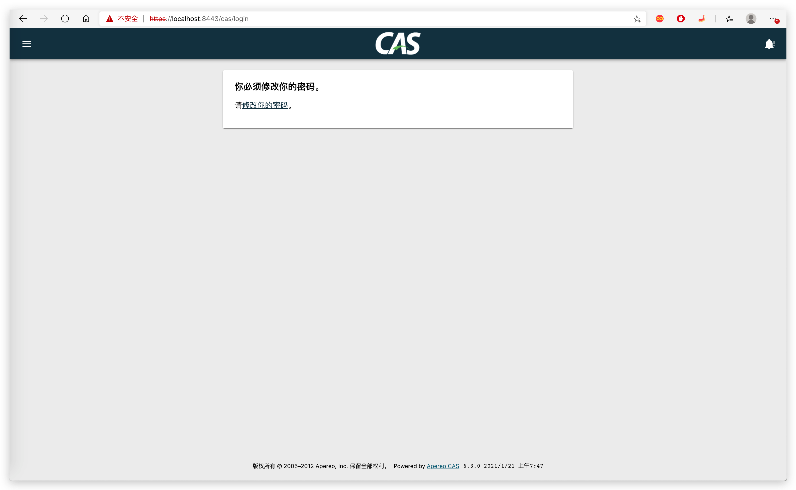

# 数据库存储账号

## JDBC依赖

增加 cas-server-support-jdbc 依赖。

```xml
<dependency>
  <groupId>org.apereo.cas</groupId>
  <artifactId>cas-server-support-jdbc</artifactId>
  <version>${cas.version}</version>
</dependency>
```

## 配置

### 创建表

账号

```sql
create table account (
  id int primary key,
  username varchar(255),
  password varchar(255),
  email varchar(255),
  phone varchar(255),
  expired tinyint(1),
  disabled tinyint(1)
);
```

### JDBC SQL配置

注释默认的 CAS Authentication Credentials 配置，增加 CAS Database authentication 配置。

```properties
##
# CAS Authentication Credentials
#
# cas.authn.accept.enabled=true
# cas.authn.accept.users=casuser::Mellon
# cas.authn.accept.name=Static Credentials

##
# CAS Database authentication
# https://apereo.github.io/cas/6.3.x/installation/Database-Authentication.html
cas.authn.jdbc.query[0].driverClass=com.mysql.cj.jdbc.MysqlDataSource
cas.authn.jdbc.query[0].url=jdbc:mysql://127.0.0.1:3306/sso?useSSL=false&useUnicode=true&characterEncoding=UTF-8
cas.authn.jdbc.query[0].user=root
cas.authn.jdbc.query[0].password=123456

cas.authn.jdbc.query[0].sql=SELECT * FROM account WHERE username=?
cas.authn.jdbc.query[0].field-password=password
cas.authn.jdbc.query[0].field-expired=expired
cas.authn.jdbc.query[0].field-disabled=disabled
```

## Webflow配置

当账号过期、禁用时，cas server 会报错，而未跳转到页面。比如过期后跳转到如下页面：



### 依赖

增加 cas-server-core-webflow-api 依赖，并将 scope 修改为 compile

```xml
<dependency>
  <groupId>org.apereo.cas</groupId>
  <artifactId>cas-server-core-webflow-api</artifactId>
  <version>${cas.version}</version>
  <scope>compile</scope>
</dependency>
```

### 自定义Webflow配置

- 自定义登录 Webflow 视图

  ```java
  package tk.fishfish.cas.server.webflow;

  import org.apereo.cas.configuration.CasConfigurationProperties;
  import org.apereo.cas.web.flow.CasWebflowConstants;
  import org.apereo.cas.web.flow.configurer.AbstractCasWebflowConfigurer;
  import org.springframework.context.ApplicationContext;
  import org.springframework.context.ConfigurableApplicationContext;
  import org.springframework.webflow.definition.registry.FlowDefinitionRegistry;
  import org.springframework.webflow.engine.Flow;
  import org.springframework.webflow.engine.builder.support.FlowBuilderServices;

  /**
   * 自定义登录Webflow
   *
   * @author 奔波儿灞
   * @version 1.0.0
   */
  public class LoginWebflowConfigurer extends AbstractCasWebflowConfigurer {

      public LoginWebflowConfigurer(FlowBuilderServices flowBuilderServices,
                                    FlowDefinitionRegistry flowDefinitionRegistry,
                                    ApplicationContext applicationContext,
                                    CasConfigurationProperties casProperties) {
          super(flowBuilderServices, flowDefinitionRegistry, (ConfigurableApplicationContext) applicationContext, casProperties);
      }

      @Override
      protected void doInitialize() {
          final Flow flow = super.getLoginFlow();
          createViewState(flow, CasWebflowConstants.VIEW_ID_ACCOUNT_DISABLED, CasWebflowConstants.VIEW_ID_ACCOUNT_DISABLED);
          createViewState(flow, CasWebflowConstants.VIEW_ID_ACCOUNT_LOCKED, CasWebflowConstants.VIEW_ID_ACCOUNT_LOCKED);
          createViewState(flow, CasWebflowConstants.VIEW_ID_MUST_CHANGE_PASSWORD, CasWebflowConstants.VIEW_ID_MUST_CHANGE_PASSWORD);
          createViewState(flow, CasWebflowConstants.VIEW_ID_EXPIRED_PASSWORD, CasWebflowConstants.VIEW_ID_EXPIRED_PASSWORD);
          createViewState(flow, CasWebflowConstants.VIEW_ID_INVALID_WORKSTATION, CasWebflowConstants.VIEW_ID_INVALID_WORKSTATION);
          createViewState(flow, CasWebflowConstants.VIEW_ID_INVALID_AUTHENTICATION_HOURS, CasWebflowConstants.VIEW_ID_INVALID_AUTHENTICATION_HOURS);
          createViewState(flow, CasWebflowConstants.VIEW_ID_AUTHENTICATION_BLOCKED, CasWebflowConstants.VIEW_ID_AUTHENTICATION_BLOCKED);
      }

  }
  ```

- Webflow自定义配置

  ```java
  package tk.fishfish.cas.server.webflow;

  import org.apereo.cas.configuration.CasConfigurationProperties;
  import org.apereo.cas.web.flow.CasWebflowConfigurer;
  import org.apereo.cas.web.flow.CasWebflowExecutionPlan;
  import org.apereo.cas.web.flow.CasWebflowExecutionPlanConfigurer;
  import org.springframework.beans.factory.annotation.Autowired;
  import org.springframework.beans.factory.annotation.Qualifier;
  import org.springframework.boot.autoconfigure.condition.ConditionalOnMissingBean;
  import org.springframework.boot.context.properties.EnableConfigurationProperties;
  import org.springframework.context.ApplicationContext;
  import org.springframework.context.annotation.Bean;
  import org.springframework.context.annotation.Configuration;
  import org.springframework.webflow.definition.registry.FlowDefinitionRegistry;
  import org.springframework.webflow.engine.builder.support.FlowBuilderServices;

  /**
   * Webflow自定义配置
   *
   * @author 奔波儿灞
   * @version 1.0.0
   */
  @Configuration("webflowConfiguration")
  @EnableConfigurationProperties(CasConfigurationProperties.class)
  public class WebflowConfiguration implements CasWebflowExecutionPlanConfigurer {

      @Autowired
      private CasConfigurationProperties casProperties;

      @Autowired
      @Qualifier("loginFlowRegistry")
      private FlowDefinitionRegistry loginFlowDefinitionRegistry;

      @Autowired
      private ApplicationContext applicationContext;

      @Autowired
      private FlowBuilderServices flowBuilderServices;

      @Bean
      @ConditionalOnMissingBean(name = "loginWebflowConfigurer")
      public CasWebflowConfigurer loginWebflowConfigurer() {
          return new LoginWebflowConfigurer(flowBuilderServices, loginFlowDefinitionRegistry, applicationContext, casProperties);
      }

      @Override
      public void configureWebflowExecutionPlan(final CasWebflowExecutionPlan plan) {
          plan.registerWebflowConfigurer(loginWebflowConfigurer());
      }

  }
  ```
  
- 注册配置

  在 src/main/resources/META-INF/spring.factories 文件下增加：

  ```properties
  org.springframework.boot.autoconfigure.EnableAutoConfiguration=tk.fishfish.cas.server.webflow.WebflowConfiguration
  ```
