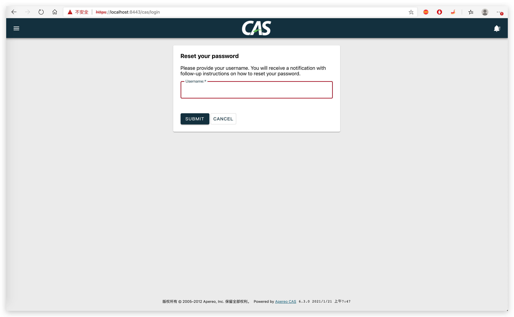

# 重置密码

## 依赖

增加 cas-server-support-pm-jdbc 依赖。

```xml
<dependency>
  <groupId>org.apereo.cas</groupId>
  <artifactId>cas-server-support-pm-jdbc</artifactId>
  <version>${cas.version}</version>
</dependency>
<dependency>
  <groupId>org.apereo.cas</groupId>
  <artifactId>cas-server-support-pm-webflow</artifactId>
  <version>${cas.version}</version>
</dependency>
```

## 创建表

找回密码问题表：

```sql
create table question (
  id int primary key,
  username varchar(255),
  question varchar(255),
  answer varchar(255)
);
```

## 配置

注意：

- cas.authn.pm.enabled 开启密码管理功能
- cas.authn.pm.reset.mail 配置邮件找回密码
- spring.mail 配置邮件发送信息

```properties

##
# CAS Password Management
# https://apereo.github.io/cas/6.3.x/password_management/Password-Management-JDBC.html
cas.authn.pm.enabled=true
cas.authn.pm.jdbc.driverClass=com.mysql.cj.jdbc.Driver
cas.authn.pm.jdbc.url=jdbc:mysql://127.0.0.1:3306/sso?useSSL=false&useUnicode=true&characterEncoding=UTF-8
cas.authn.pm.jdbc.user=root
cas.authn.pm.jdbc.password=123456
cas.authn.pm.jdbc.sql-security-questions=SELECT question, answer FROM question WHERE username=?
cas.authn.pm.jdbc.autocommit=true

cas.authn.pm.jdbc.sql-find-email=SELECT email FROM account WHERE username=?
cas.authn.pm.jdbc.sql-find-phone=SELECT phone FROM account WHERE username=?
cas.authn.pm.jdbc.sql-find-user=SELECT username FROM account WHERE email=?
cas.authn.pm.jdbc.sql-change-password=UPDATE account SET password=? WHERE username=?

# 重置密码
cas.authn.pm.reset.mail.from=${spring.mail.username}
# 发送邮件标题
cas.authn.pm.reset.mail.subject=SSO 重置密码
# 邮件内容，必须要有%s，因为会生成一个连接并且带了token，否则无法打开链接，当然这个链接也和cas.server.prefix有关系
cas.authn.pm.reset.mail.text=打开以下链接重置您的密码（SSO）: %s
# token失效分钟数
cas.authn.pm.reset.expirationMinutes=10
# 是否开启问题回答
cas.authn.pm.reset.securityQuestionsEnabled=false

##
# CAS 发送邮件
spring.mail.host=smtp.qq.com
spring.mail.port=465
# 邮箱用户名
spring.mail.username=1345545983@qq.com
# 邮箱授权码
spring.mail.password=rerbwncyyvvqjhif
spring.mail.testConnection=false
spring.mail.properties.mail.smtp.auth=true
# 必须ssl
spring.mail.properties.mail.smtp.ssl.enable=true
```

目前 sms 找回密码功能暂未测试。


